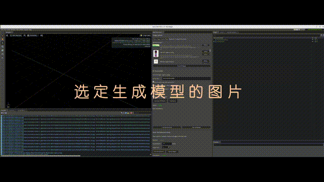

# 混元 AIGC 扩展 (Hunyuan AIGC Extension)

## 🎬 演示视频 / Demo Video

> 📥 **[点击下载完整演示视频 / Click to Download Full Demo Video (63MB, 2:30)](https://github.com/vigorc/hunyuan_AIGC_extension/raw/main/QFJA9420.MP4)**

*上方为20秒 GIF 预览（视频中间部分），完整视频请点击上方链接下载*  
*Above is a 20-second GIF preview (middle section of the video). Click the link above to download the full video.*

---

## 📖 概述 (Overview)

这是一个为 NVIDIA Omniverse 开发的 AIGC 3D 生成扩展，提供图像上传、可变形物理支持和缩放工具功能。

This extension provides AIGC 3D generation functionality with image upload, deformable physics support, and scale tools for NVIDIA Omniverse.

## ✨ 功能特性 (Features)

- **图像上传 / Image Upload**: 上传单个图像或整个文件夹
- **3D 生成 / 3D Generation**: 使用混元 API 从图像生成 3D 模型
- **物理支持 / Physics Support**: 
  - 可变形物理，支持自定义参数
  - 刚体物理，支持多种碰撞器类型
- **自动加载 / Auto-loading**: 自动将生成的模型加载到场景
- **缩放工具 / Scale Tool**: 将生成的模型缩放到实际真实世界尺寸

## 🚀 使用方法 (Usage)

### 3D 生成 (3D Generation)
1. 使用 "Select Image" 或 "Select Folder" 选择图像
2. 配置服务器 URL（默认：http://localhost:8081）
3. 点击 "Generate 3D Model" 开始生成
4. 生成的模型将被保存并可选择加载到场景中

### 缩放工具 (Scale Tool)
1. 在视口中选择一个 prim（模型）
2. 点击 "Get Selected Prim" 查看当前尺寸
3. 输入对象的实际高度（米）
4. 选择高度轴（Y、X 或 Z - 默认为 Y）
5. 点击 "Scale to Height" 应用统一缩放

**示例 / Example**: 
如果生成的椅子显示 2.0m 高度但实际椅子是 0.95m：
- 当前 / Current: 2.0m
- 目标 / Target: 0.95m
- 缩放因子 / Scale Factor: 0.475x (47.5%)
- 结果 / Result: 椅子将统一缩放到 0.95m 高度

## 📋 要求 (Requirements)

- NVIDIA Omniverse
- 混元 API 服务器运行在配置的 URL 上（用于 3D 生成）

## 📚 文档 (Documentation)

更多详细信息请查看 [docs/README.md](docs/README.md)

## 📄 许可证 (License)

查看 [PACKAGE-LICENSES](PACKAGE-LICENSES/) 目录了解详情

---

**Made with ❤️ for NVIDIA Omniverse**

